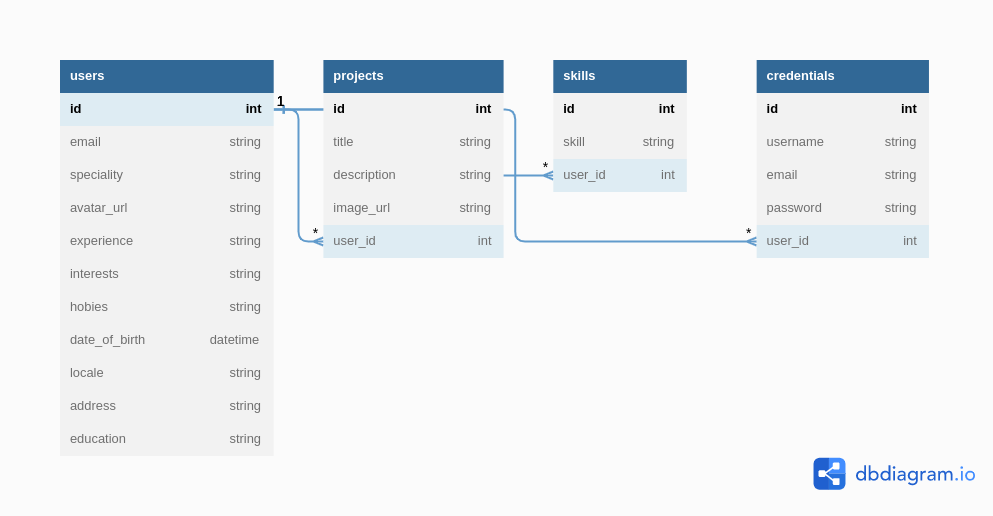

# Phase 3 Project Guidelines

## Entity Relationship Diagram 


## Client side GitHub repository

- [Client side GitHub repository](https://github.com/ogada-otieno/client-server-portfolio-app)

## Learning Goal

- Build a web basic API with Sinatra and Active Record to support a React
  frontend

## Introduction

Congrats on getting through all the material for Phase 3! Now's the time to put
it all together and build something from scratch to reinforce what you know and
expand your horizons.

The focus of this project is **building a Sinatra API backend** that uses
**Active Record** to access and persist data in a database, which will be used
by a separate **React frontend** that interacts with the database via the API.

## Requirements

For this project, you must:

- Use Active Record to interact with a database.
- Have at least two models with a one-to-many relationship.
- At a minimum, set up the following API routes in Sinatra:
  - create and read actions for both models
  - full CRUD capability for one of the models: 
  The update action should be implemented using a form that is 
  pre-filled with existing values for the object. On submission of 
  the form, the object should update. Note: Using a like button or 
  similar will not meet the update requirement.
- Build a separate React frontend application that interacts with the API to
  perform CRUD actions.
- Implement proper front end state management. You should be updating state using a
  setState function after receiving your response from a POST, PATCH, or DELETE 
  request. You should NOT be relying on a GET request to update state. 
- Use good OO design patterns. You should have separate classes for each of your
  models, and create instance and class methods as necessary. 
- Routes in your application (both client side and back end) should follow RESTful
  conventions.
- Use your back end optimally. Pass JSON for related associations to the front 
  end from the back end. You should use active record methods in your controller to grab
  the needed data from your database and provide as JSON to the front end. You
  should NOT be relying on filtering front end state or a separate fetch request to
  retrieve related data.

For example, build a todo list application with a React frontend interface and a
Sinatra backend API, where a user can:

- **Create** a new todo
- **Read** a list of all todos
- **Update** an individual todo
- **Delete** a todo

A `Todo` can be tagged with a `Category`, so that each todo _belongs to_ a
category and each category _has many_ todos.

## Getting Started

### Backend Setup

This repository has all the starter code needed to get a Sinatra backend up and
running. [**Fork and clone**][fork link] this repository to get started. Then, run
`bundle install` to install the gems.

**Important**: Be sure you fork a copy of the repo into your GitHub account
before cloning it. You can do this by using the link above or by clicking the
"Octocat" button at the top of this page, then clicking "Fork" in the upper
right corner of the repo page.

[fork link]: https://github.com/learn-co-curriculum/phase-3-sinatra-react-project/fork

The `app/controllers/application_controller.rb` file has an example GET route
handler. Replace this route with routes for your project.

You can start your server with:

```console
$ bundle exec rake server
```

This will run your server on port
[http://localhost:9292](http://localhost:9292).

### Frontend Setup

Your backend and your frontend should be in **two different repositories**.

Create a new repository in a **separate folder** with a React app for your
frontend. To do this, `cd` out of the backend project directory, and use
[create-react-app][] to generate the necessary code for your React frontend:

```console
$ npx create-react-app my-app-frontend
```

After creating the project locally, you should also
[create a repository on GitHub][create repo] to host your repo and help
collaborate, if you're working with a partner.

### Fetch Example

Your React app should make fetch requests to your Sinatra backend! Here's an
example:

```js
fetch("http://localhost:9292/test")
  .then((r) => r.json())
  .then((data) => console.log(data));
```

## Project Tips

- This project is intended to focus more on the backend than the frontend, so
  try and keep the React side of things relatively simple. Focus on working with
  Active Record and performing CRUD actions. What are some interesting queries you can write? What kinds of questions can you ask of your data?
- Once you have a project idea, come up with a domain model and decide what
  relationships exist between the models in your application. Use a tool like
  [dbdiagram.io][] to help visualize your models.
- Decide on your API endpoints. What data should they return? What kind of CRUD
  action should they perform? What data do they need from the client?
- Use [Postman][postman download] to test your endpoints.
- Use `binding.pry` to debug your requests on the server. It's very helpful to use a
  `binding.pry` in your controller within a route to see what `params` are being
  sent.
- Use the [Network Tab in the Dev Tools][network tab] in the frontend to debug
  your requests.

## Resources

- [create-react-app][]
- [dbdiagram.io][]
- [Postman][postman download]

[create-react-app]: https://create-react-app.dev/docs/getting-started
[create repo]: https://docs.github.com/en/get-started/quickstart/create-a-repo
[dbdiagram.io]: https://dbdiagram.io/
[postman download]: https://www.postman.com/downloads/
[network tab]: https://developer.chrome.com/docs/devtools/network/
